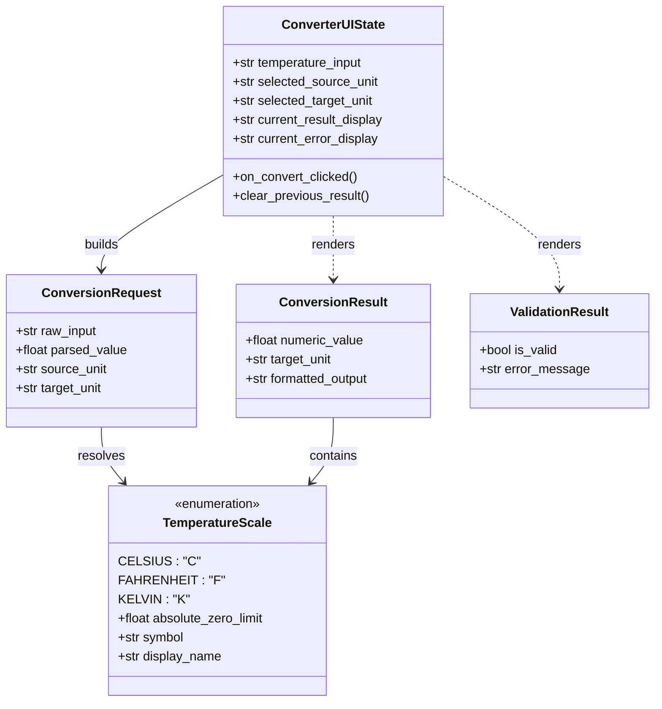

# Data Model: Conversor de Temperatura (Tkinter & CLI)

**Feature**: Conversor de temperatura entre Celsius, Fahrenheit y Kelvin
**Branch**: `001-temp-converter`
**Date**: 2026-09-28

## 1. Diagrama de Dominio y Estado de Interfaz

---

## 2. Entidades de Dominio

### 2.1. Escala de Temperatura (`TemperatureScale`)
- **Valores posibles**:
  - `CELSIUS` (`C`): Cero absoluto en $-273.15$
  - `FAHRENHEIT` (`F`): Cero absoluto en $-459.67$
  - `KELVIN` (`K`): Cero absoluto en $0.0$
- **Normalización**: Soporta símbolos (`C`, `F`, `K`) y nombres completos en mayúsculas/minúsculas.

### 2.2. Solicitud de Conversión (`ConversionRequest`)
- `raw_input`: Cadena de texto recibida desde el campo de texto de la interfaz gráfica o argumento de línea de comandos.
- `source_unit`: Identificador de la escala seleccionada en el combo de origen.
- `target_unit`: Identificador de la escala seleccionada en el combo de destino.

### 2.3. Resultado de Conversión (`ConversionResult`)
- `numeric_value`: Valor numérico resultante sin redondeos intermedios.
- `formatted_output`: Cadena con formato exacto `"{numeric_value:.2f} {target_unit}"`.
- Si `abs(numeric_value) < 1e-9`, se normaliza a `0.00`.

---

## 3. Modelo de Estado de la Interfaz Tkinter (`ConverterUIState`)

| Campo de Estado | Tipo | Valor Inicial | Comportamiento |
|---|---|---|---|
| `temperature_input` | `StringVar` | `""` | Vinculado al campo de texto `ttk.Entry` |
| `source_unit` | `StringVar` | `"C"` | Vinculado al selector `ttk.Combobox` de origen |
| `target_unit` | `StringVar` | `"F"` | Vinculado al selector `ttk.Combobox` de destino |
| `result_text` | `StringVar` | `""` | Se actualiza a `"Resultado: 212.00 F"` solo si la conversión es exitosa |
| `error_text` | `StringVar` | `""` | Muestra el mensaje de validación si la entrada es inválida |

### Reglas de Transición de la Interfaz:
1. Al pulsar **Convertir** (o presionar `Enter`):
   - Se limpia `error_text` (`""`).
   - Se limpia `result_text` (`""`).
   - Se valida `temperature_input`:
     - Si está vacío o solo espacios $\rightarrow$ `error_text = "Ingrese una temperatura"`, `result_text = ""`.
     - Si no es numérico $\rightarrow$ `error_text = "Ingrese un número válido"`, `result_text = ""`.
     - Si es menor al cero absoluto $\rightarrow$ `error_text = "Temperatura inferior al cero absoluto"`, `result_text = ""`.
   - Si todas las validaciones son satisfactorias:
     - Se calcula la conversión.
     - `result_text = "Resultado: {formatear_resultado(res, target_unit)}"`.
     - `error_text = ""`.
2. Las conversiones consecutivas no conservan el resultado anterior si la nueva entrada produce un error.
